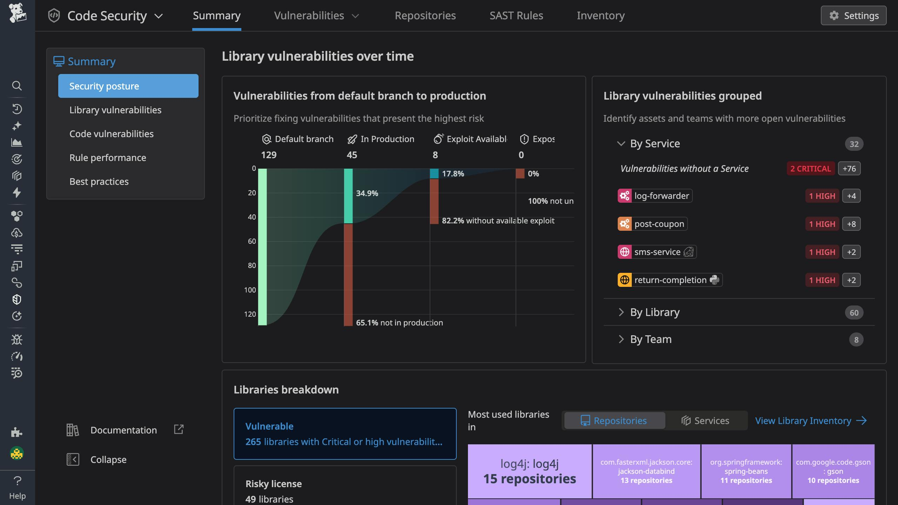

# Schemas

## v1.1
* Add SCA `ignore-paths` configuration

## v1.0
* Add SAST configuration

# Code Security

For development, operations, and security teams overwhelmed by a growing backlog of reported security vulnerabilities, Datadog Code Security delivers runtime-based prioritization of vulnerabilities with a platform approach to remediation. A unified, end-to-end solution allows teams to focus on fixing vulnerabilities that matter, with clear visibility into remediation progress across the software development lifecycle.

# Capabilities

* [Static Code Analysis (SAST)](https://docs.datadoghq.com/security/code_security/static_analysis/) for identifying security and quality issues in your first-party code
* [Software Composition Analysis (SCA)](https://docs.datadoghq.com/security/code_security/software_composition_analysis/) for identifying open source dependencies in both your repositories and your services
* [Runtime Code Analysis (IAST)](https://docs.datadoghq.com/security/code_security/iast/) for identifying vulnerabilities in the first-party code within your services
* [Secret Scanning](https://docs.datadoghq.com/security/code_security/secret_scanning/) for identifying and validating leaked secrets
* [Infrastructure as Code (IaC) Security](https://docs.datadoghq.com/security/code_security/iac_security/) for identifying security misconfigurations in Terraform files stored in your repositories

# Getting Started

[Try Code Security Free](https://www.datadoghq.com/product/code-security/)
