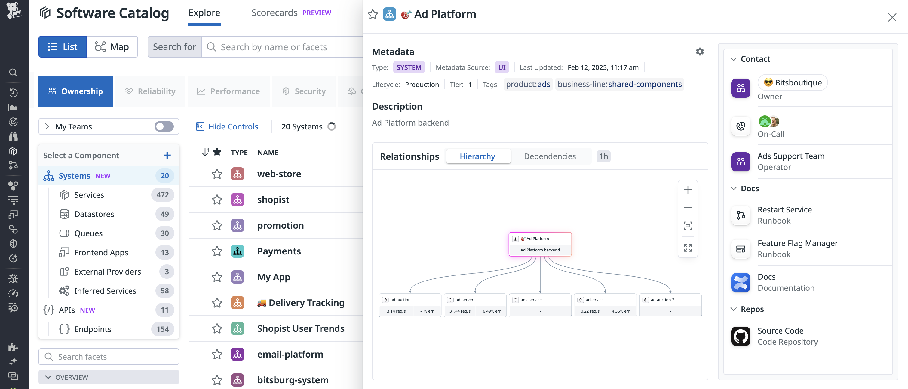
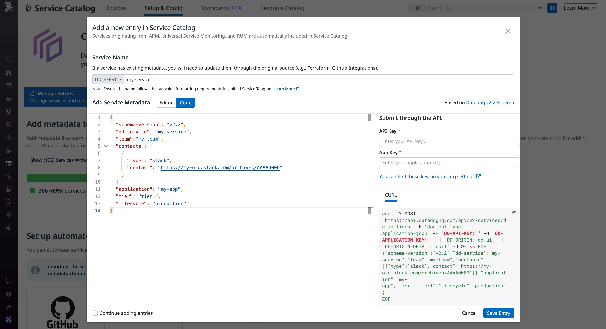

# Schema (v3)
 An [Entity Catalog](https://docs.datadoghq.com/service_catalog/add_metadata#metadata-schema-v30-beta) is a powerful way to capture and manage the complex web of relationships between all the components of an organization's infrastructure and softwares, beyond services. 

# Schema (v2.2)
Service Definition Schema is a JSON Schema that can be used to define metadata about a service in Datadog's Software Catalog. The latest schema version is v2.2. The schema is often used to: 
* Communicate a set of accepted metadata fields for a service
* Provide client side validations against user defined metadata files
* Add auto completion and validation in popular IDEs for user defined metadata files

Learn more about [v2.2](https://docs.datadoghq.com/tracing/service_catalog/adding_metadata#service-definition-schema-v22) and other supported schema versions including [v2.1](https://docs.datadoghq.com/tracing/service_catalog/adding_metadata#service-definition-schema-v21) and [v2](https://docs.datadoghq.com/tracing/service_catalog/adding_metadata#service-definition-schema-v21) on Datadog's public docs.

# What is the Software Catalog?
Software Catalog is a new Datadog product that allows you to easily manage service ownership at scale and identify dependencies in complex, microservice-based applications. Built on top of the unified Datadog observability platform, Software Catalog helps you:

* Streamline root-cause investigations via a unified observability tool that leverages built-in integrations for Slack, PagerDuty, and Source Code 
* Automatically discover hundreds of APM services and RUM applications to quickly find owners, on-call engineers, and critical resources with minimal engineering effort
* Shorten new hire onboarding time with out-of-the-box answers to questions about system architecture, ownership, and different types of telemetry 

# Getting Started
Check out our [onboarding guide](https://docs.datadoghq.com/tracing/service_catalog/setup) on how to get started. 

# Documentation 
* [Product Overview](https://docs.datadoghq.com/tracing/faq/service_catalog/)
* [Service Definition Structure](https://docs.datadoghq.com/tracing/service_catalog/service_metadata_structure)
* [Service Definition API](https://docs.datadoghq.com/api/latest/service-definition/)
* [Understanding Your Service Configuration](https://docs.datadoghq.com/tracing/service_catalog/guides/understanding-service-configuration/)
* [Validating Service Definition YAMLs](https://docs.datadoghq.com/tracing/service_catalog/guides/validating-service-definition/)
* [Manage Service Catalog Entries with the Service Definition JSON Schema](https://www.datadoghq.com/blog/manage-service-catalog-categories-with-service-definition-json-schema/)
* [Troubleshooting Guide](https://docs.datadoghq.com/tracing/service_catalog/troubleshooting)
* [JSON Schema Store](https://raw.githubusercontent.com/DataDog/schema/main/service-catalog/version.schema.json)
