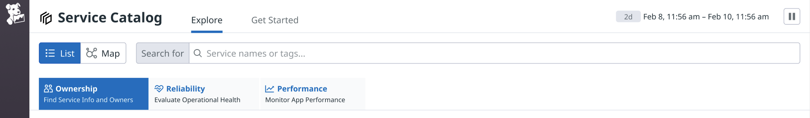

# Service Catalog 

## What is the Service Catalog?
Service Catalog is a new Datadog product that allows you to easily manage service ownership at scale and identify dependencies in complex, microservice-based applications. Built on top of the unified Datadog observability platform, Service Catalog helps you:

* Streamline root-cause investigations via a unified observability tool that leverages built-in integrations for Slack, PagerDuty, and Source Code 
* Automatically discover hundreds of APM services and RUM applications to quickly find owners, on-call engineers, and critical resources with minimal engineering effort
* Shorten new hire onboarding time with out-of-the-box answers to questions about system architecture, ownership, and different types of telemetry 

## Getting Started
Check out our [onboarding guide](https://www.datadoghq.com) on how to get started. 

## Service Catalog Definition Schema 

## Documentation 
* [Product Overview](https://docs.datadoghq.com/tracing/faq/service_catalog/)
* Setting up Service Catalog as an APM customer [Setting up Service Catalog as an APM * customer
* Setting up Service Catalog as a non-APM customer [Setting up Service Catalog as a non-APM customer
* Service Catalog API : Registering Services through the Datadog Service Definition API
* Integrations 
* JSON Schema Store 
* Troubleshooting 
* Guides